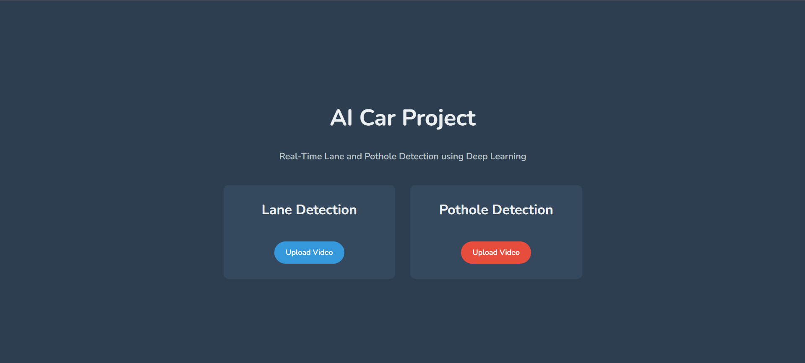
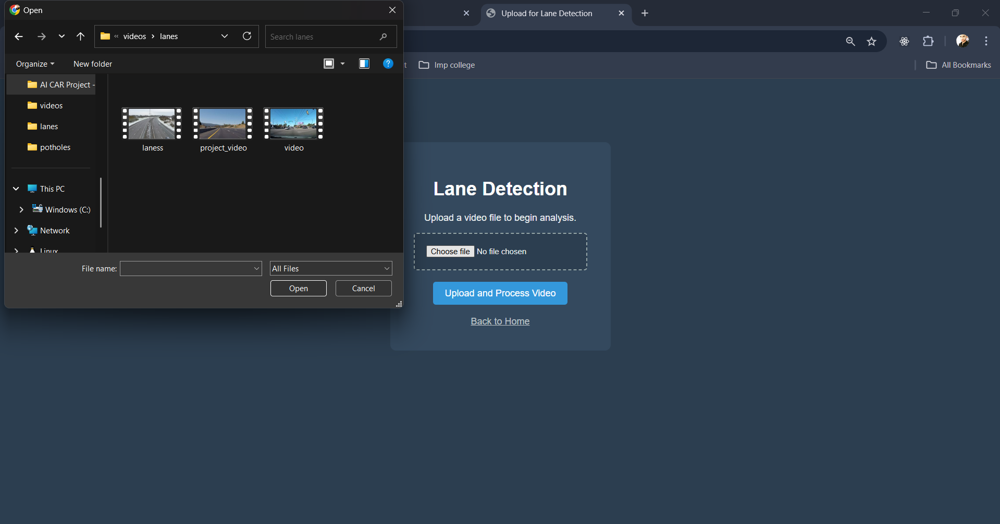
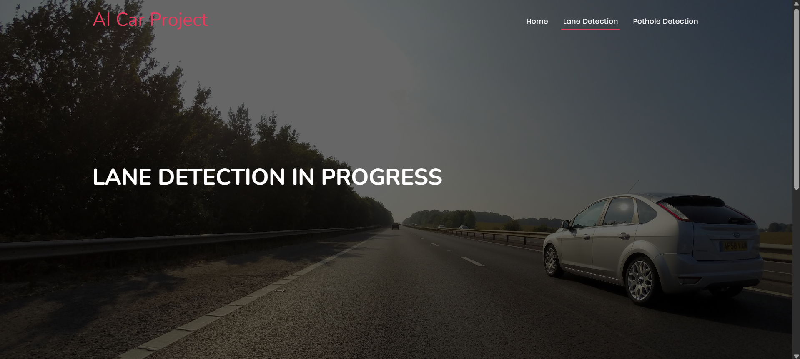
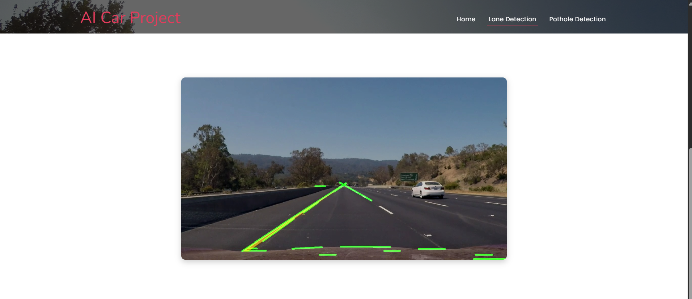
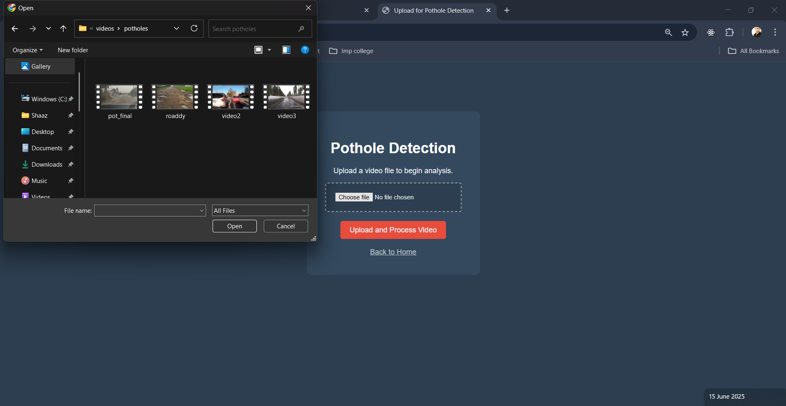
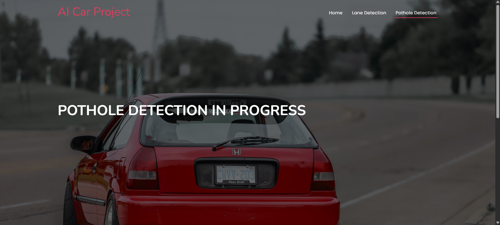
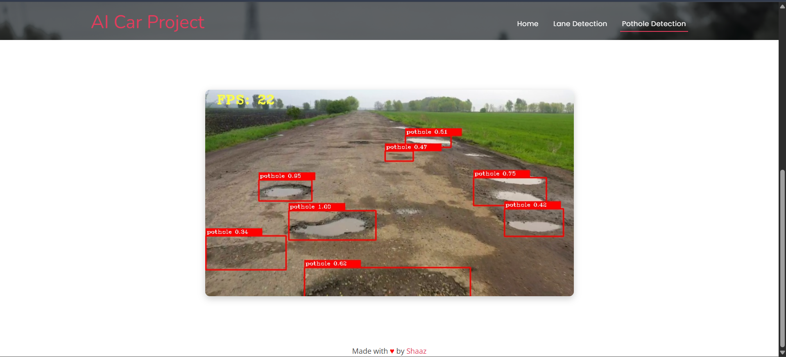

# 🤖 AI RealTime Detection Of DamagedRoad & LaneDetection

This project is an advanced perception system that uses computer vision to perform real-time lane detection and identify damaged road conditions from a video feed.

By analyzing road imagery, the application can pinpoint potential hazards like cracks and potholes while simultaneously tracking lane boundaries, making it a powerful tool for road maintenance analysis and driver-assistance systems.

---

## 🚀 Key Features

-   **Real-Time Lane Detection:** Implements computer vision techniques like the Hough Transform to accurately identify and track lane lines on various road types.
-   **Damaged Road Detection:** A key safety feature that analyzes the road texture and surface to detect potential hazards like potholes and significant cracks.
-   **Dual Mode Operation:**
    -   **Video File Analysis:** Process any pre-recorded video of a road to test and validate the detection algorithms.
    -   **Live Camera Feed:** Use a webcam to perform lane and hazard detection in real-time.
-   **Interactive Web Interface:** A clean UI built with Flask to handle video uploads and display the processed output with detections overlaid.
-   **Optimized for Performance:** Utilizes the highly efficient OpenCV library for real-time video frame processing.

---

## 🛠️ Technologies & Libraries Used

-   **Backend:** Python, Flask
-   **Computer Vision:** OpenCV
-   **Numerical Processing:** NumPy
-   **Version Control:** Git & Git LFS (for handling large video files)
-   **Deployment (Planned):** Render, Gunicorn

---

## 🏁 Getting Started: How to Run Locally

Follow these instructions to get a copy of the project up and running on your local machine for development and testing purposes.

### Prerequisites

-   Python 3.8+ and Pip
-   Git and [Git LFS](https://git-lfs.github.com/) must be installed.

### Installation & Setup

1.  **Clone the repository:**
    *This command will also download the large video files handled by Git LFS.*
    ```sh
    git clone [https://github.com/CodewithShaaz/AI-RealTime-Detection-Of-DamagedRoad-LaneDetection.git](https://github.com/CodewithShaaz/AI-RealTime-Detection-Of-DamagedRoad-LaneDetection.git)
    cd AI-RealTime-Detection-Of-DamagedRoad-LaneDetection
    ```

2.  **Create and activate a virtual environment (Recommended):**
    ```sh
    # For Windows
    python -m venv venv
    venv\Scripts\activate

    # For macOS/Linux
    python3 -m venv venv
    source venv/bin/activate
    ```

3.  **Install the required libraries:**
    ```sh
    pip install -r requirements.txt
    ```
    *(Note: If `requirements.txt` doesn't exist yet, create it with `pip freeze > requirements.txt`)*

### Running the Application

1.  **Navigate to the Code directory:**
    ```sh
    cd Code
    ```

2.  **Run the Flask app:**
    ```sh
    python app.py
    ```

3.  Open your web browser and go to `http://127.0.0.1:5000` to see the application live.

---

## 🖼️ Demo Images


<p align="center">
  
  
  
  
  
  
  
</p>
